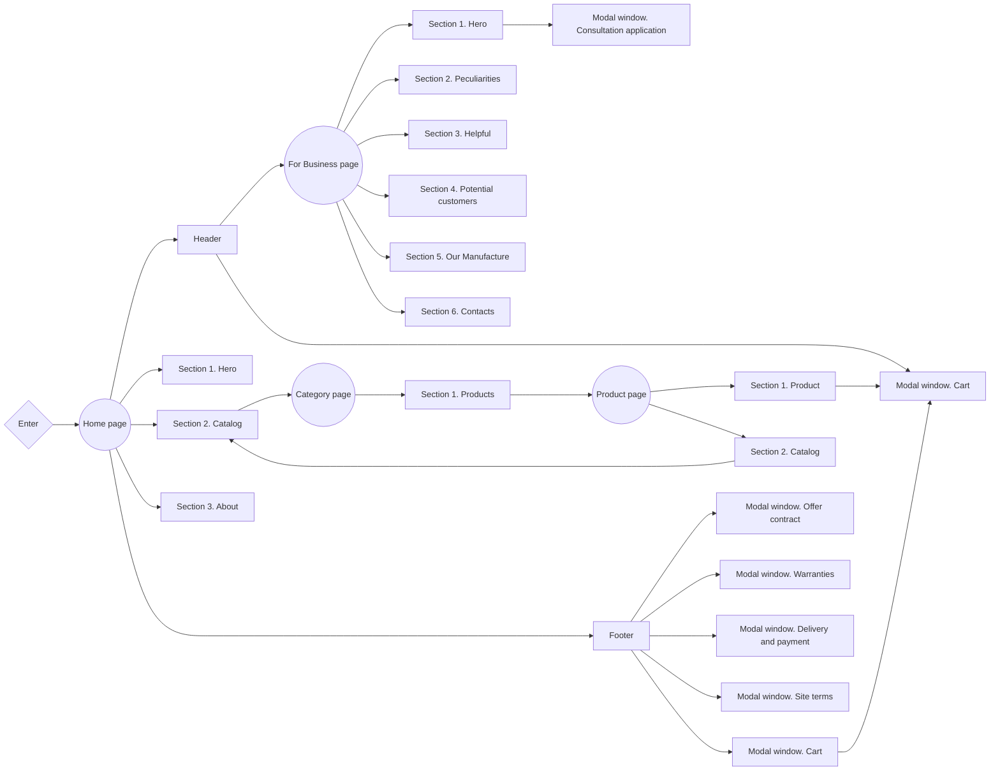

# 13 CANDLE BAR 🕯️

<a href="./README.uk.md" style="background-color: teal; color: white; padding: 4px; border-radius: 4px; display: inline-block; margin-bottom: 4px; width: 100px; text-align: center"">To read on 🇺🇦</a>

<a href="https://13candles-frontend.vercel.app/" 
    target="_blank"
    rel="nofollow noopener noreferrer" 
    style="background-color: teal; color: white; padding: 4px; border-radius: 4px; display: inline-block; width: 100px; text-align: center">Live page 🚀</a>

---

## 📝 Project description

E-commerce website for the **13 Candle Bar** online store.

- **Project name**: 13 Candle Bar
- **Project goals**:
  - Creating a positive personal brand image
  - Attracting new customers / partners
  - Selling goods through the online store
  - Informing consumers
- **Target audience**:
  - **Age**: 20-45+
  - **Gender**: Female
- **Product scope**: Development of a multi-page e-commerce website for the 13
  Candle Bar, whose main field of activity is the sale of flavored products
  online.

## 🛠️ Creating the project

**13 Candle Bar** is a [Next.js](https://nextjs.org/) project bootstrapped with
[`create-next-app`](https://github.com/vercel/next.js/tree/canary/packages/create-next-app).

### Features

- **Optimization**: The website is optimized for fast loading, providing users
  with quick access to information.
- **Modularity and reusability**: The product is built using a component
  approach, which makes the code modular and allows components to be used on
  different pages and in different sections of the project. This simplifies the
  maintenance of the site and the expansion of its functionality.
- **Linters and formatting**: Using tools like Prettier and ESLint helps
  maintain code standards, ensures a consistent style, and identifies potential
  problems in the code.
- **Adaptability**: The website is responsive, allowing you to create dynamic
  and interactive user interfaces without reloading pages. This increases user
  engagement and interaction.
- **Convenient content management**: The content management system has an
  intuitive interface that simplifies the process of updating and editing
  content. You can easily make changes to texts, images and other content
  without special knowledge in web development.

### Accessibility

- Intuitive design
- Semantic HTML
- Mobile-friendly interface
- Web resource available for any internet connection

### Supported Languages

- Ukrainian
- English

### Product structure

### Design

[Design layout on Figma](https://www.figma.com/file/8TJ2ei6yVHA8S8vciTGkmm/13-Candles?node-id=246%3A3772&mode=dev)

### Technology stack

- **Main technologies**:
  - Next.js (app router)
  - TypeScript
  - Tailwind CSS
  - Strapi CMS (backend)
- **Additional dependencies**:

  - GraphQL
  - Zustand
  - Immer
  - Swiper
  - React Hook Form
  - React Toastify
  - React Transition
  - Classnames

  ...full list of dependencies is available in `package.json` file.

## 📂 Deployment

To deploy this project, you need to perform the following steps:

1. **Clone the repository**: Use the `git clone` command to clone this
   repository to your computer.
2. **Install the dependencies**: Open a terminal in the root of the project and
   run `npm install` or `yarn install` to install all required dependencies.
3. **Setting environment variables**: Create a `.env` file in the root folder
   and add the necessary environment variables that you need for the project
   according to the `.env.local.example` file.
4. **Run the application**: Run the `npm run dev` or `yarn dev` command to run
   the project on the local server.
5. **Deploy**: To deploy this project to a production server, use hosting
   platforms such as Vercel, Netlify, or others.

## ☎️ Contacts

**SoftRyzen** is ready to answer your questions and provide additional
information:

- **Website**: [softryzen.com](https://softryzen.com/)
- **Phone**: <a href="tel:+380979769625">+380979769625</a>
- **Email**: [services@softryzen.com](mailto:services@softryzen.com)
- **YouTube channel**:
  [https://www.youtube.com](https://www.youtube.com/watch?v=_X7NLwgdfgI)

---

