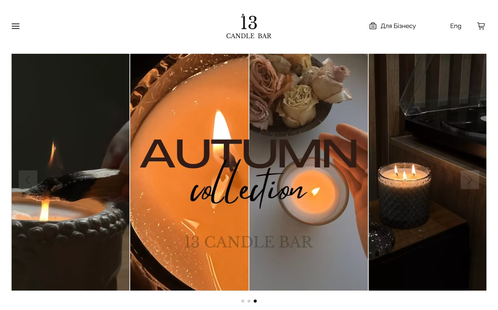
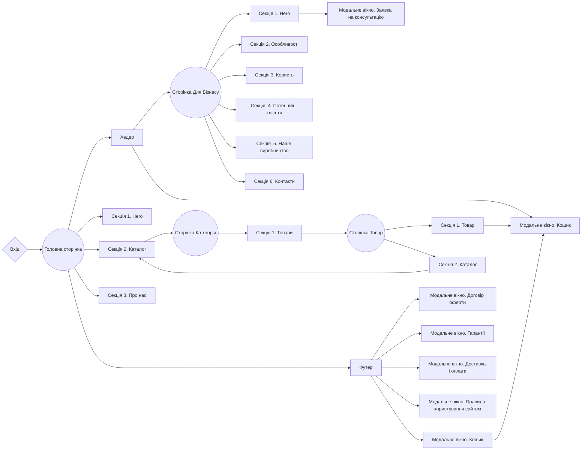
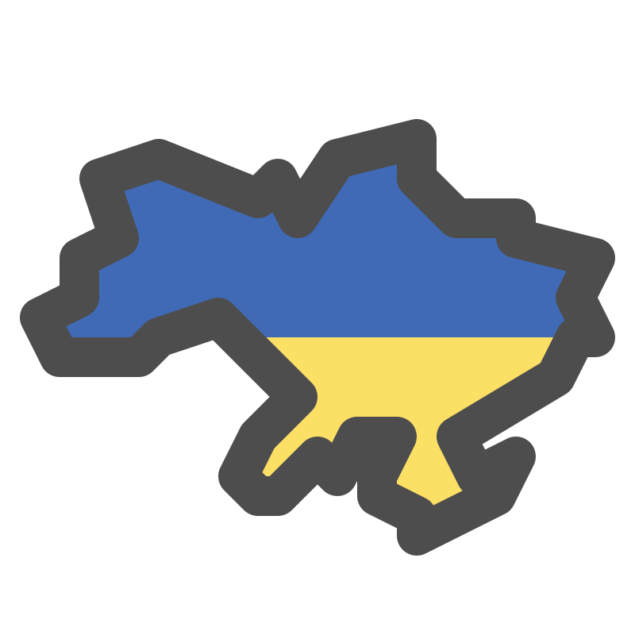

# 13 CANDLE BAR 🕯️

<a href="https://13candles-frontend.vercel.app/" 
    target="_blank"
    rel="nofollow noopener noreferrer" 
    style="background-color: teal; color: white; padding: 4px; border-radius: 4px; display: inline-block; width: 140px; text-align: center">Жива сторінка 🚀</a>

---

## 📝 Опис проєкту

Комерційний веб-сайт для онлайн магазину **13 Candle Bar**.

- **PНазва проєкту**: 13 Candle Bar
- **Мета проєкту**:
  - Створення позитивного іміджу особистого бренду
  - Залучення нових клієнтів / партнерів.
  - Продаж товарів через онлайн магазин
  - Інформування клієнтів
- **Цільова аудиторія**:
  - **Вікова категорія**: 20-45+
  - **Стать**: Жіноча
- **Обсяг продукту**: Розробка багатосторінкового веб-сайту електронної комерції
  для магазину **13 Candle Bar**, основною сферою діяльності якого є продаж
  ароматизованої продукції онлайн.

## 🛠️ Створення проєкту

**13 Candle Bar** це [Next.js](https://nextjs.org/) проєкт, побудований на
основі
[`create-next-app`](https://github.com/vercel/next.js/tree/canary/packages/create-next-app).

### Особливості

- **Оптимізація**: Веб-сайт оптимізовано для швидкого завантаження, забезпечуючи
  користувачам швидкий доступ до інформації.

- **Модульність та повторне використання**: Продукт розроблено з використанням
  компонентного підходу, що робить код модульним і дозволяє використовувати
  компоненти на різних сторінках та в різних секціях проєкту. Це спрощує
  підтримку сайту і розширення його функціональності.

- **Лінтери та форматування**: Використання таких інструментів, як Prettier і
  ESLint, допомагає зберігати стандарти коду, забезпечує послідовний стиль і
  виявляє потенційні проблеми в коді.

- **Адаптивність**: Веб-сайт адаптивний, що дозволяє створювати динамічні та
  інтерактивні інтерфейси користувача без перезавантаження сторінок. Це підвищує
  залучення та взаємодію користувачів.

- **Зручне управління контентом**: Система управління контентом має інтуїтивно
  зрозумілий інтерфейс, що спрощує процес оновлення та редагування контенту. Ви
  можете легко вносити зміни в тексти, зображення та інший вміст, не потребуючи
  спеціальних знань у веб-розробці.

### Доступність

- Інтуїтивно зрозумілий дизайн
- Семантичний HTML
- Зручний для мобільних пристроїв інтерфс
- Веб-ресурс доступний для будь-якого девайсу, що має підключення до Інтернету

### Мови, що підтримуються

- Українська
- Англійська

### Структура продукту

### Дизайн

[Макет дизайну в Figma](https://www.figma.com/file/8TJ2ei6yVHA8S8vciTGkmm/13-Candles?node-id=246%3A3772&mode=dev)

### Стек технологій

- **Основні технології**:
  - Next.js (app router)
  - TypeScript
  - Tailwind CSS
  - Strapi CMS (backend)
- **Додаткові залежності**:

  - GraphQL
  - Zustand
  - Immer
  - Swiper
  - React Hook Form
  - React Toastify
  - React Transition
  - Classnames

  ...повний список залежностей доступний в файлі `package.json`.

## 📂 Розгортання

Для розгортання цього проєкту вам потрібно виконати наступні кроки:

1. **Клонуйте репозиторій**: Використовуйте команду `git clone` для клонування
   цього репозиторію на ваш комп'ютер.
2. **Встановіть залежності**: Відкрийте термінал у кореневій папці проєкту та
   виконайте команду `npm install` або `yarn install`, щоб встановити всі
   необхідні залежності.
3. **Налаштування змінних середовища**: Створіть файл `.env` у кореневій папці
   та додайте необхідні змінні середовища, які вам потрібні для проєкту,
   відповідно до файлу `.env.local.example`.
4. **Запустіть додаток**: Виконайте команду `npm run dev` або `yarn dev`, щоб
   запустити проєкт на локальному сервері.
5. **Розгортання**: Щоб розгорнути цей проєкт на продакшн-сервері, скористайтеся
   платформами для хостингу, такими як Vercel, Netlify, або інші.

## ☎️ Контакти

Компанія **SoftRyzen** готова відповісти на ваші запитання і надати додаткову
інформацію:

- **Веб-сайт**: [softryzen.com](https://softryzen.com/)
- **Телефон**: <a href="tel:+380979769625">+380979769625</a>
- **Електронна пошта**: [services@softryzen.com](mailto:services@softryzen.com)
- **YouTube канал**:
  [https://www.youtube.com](https://www.youtube.com/watch?v=_X7NLwgdfgI)

---

